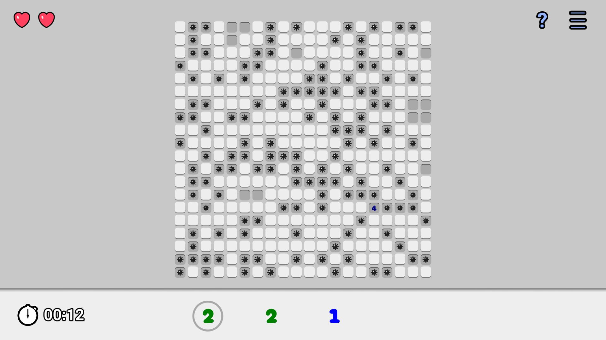

# Minesweepr Reverse
This is a puzzle game with procedurally generated levels. You can read the full description and play it [on Yandex Games](https://yandex.ru/games/app/241507) or [on itch.io](https://m039.itch.io/minesweeper-reverse).

The game is made with Unity, and in this project, I used VContainer for the first time.

